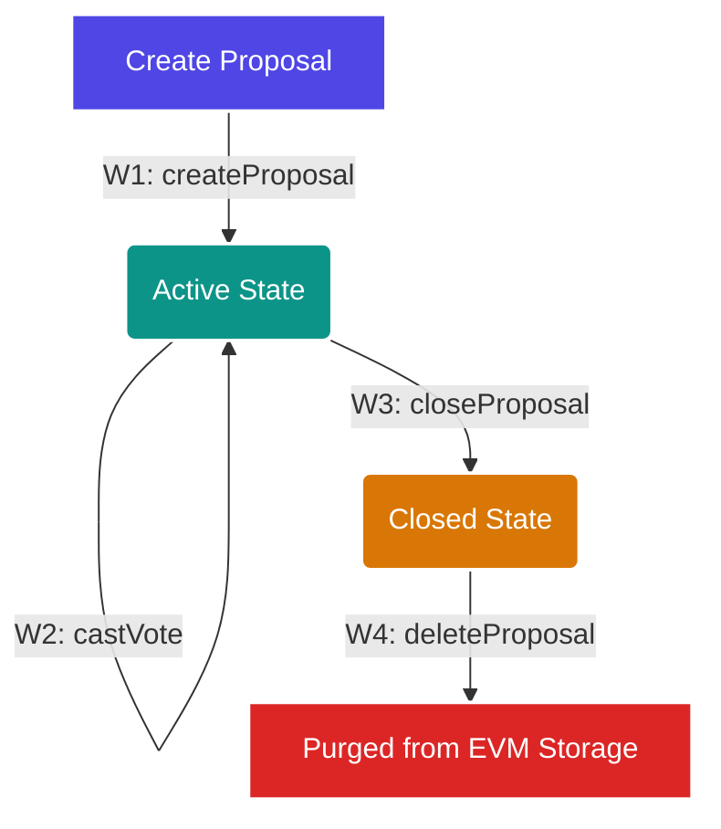

# NexusDAO

NexusDAO is a decentralized governance platform (Decentralized Autonomous Organization) built on the Ethereum blockchain. This project provides a full CRUD (Create, Read, Update, Delete) Smart Contract architecture paired with a modern React-based Web3 client interface.

<div align="center">
  
  
  
  
  
</div>

---

## 📊 Governance Workflow

The lifecycle of a proposal within NexusDAO is managed sequentially via the following state transitions on the blockchain:



---

## 🛠 Technical Specifications

### 1. Web3 Environment Configuration
The system uses the following configuration for local development and testing:

| Parameter | Value | Description |
|---|---|---|
| **Chain ID** | `31337` | Local Anvil Test Network |
| **RPC Endpoint** | `http://127.0.0.1:8545` | JSON-RPC local node interface |
| **Default Deployer** | `0xf39Fd6e51aad88F6F4ce6aB8827279cffFb92266` | Pre-funded local account (10,000 ETH) |
| **Default Contract Address** | `0x5FbDB2315678afecb367f032d93F642f64180aa3` | Deterministic deployment address |

### 2. Smart Contract Capabilities (CRUD)
The `NexusDAO.sol` contract implements comprehensive state management on the Ethereum Virtual Machine (EVM):

*   **W1: Create Proposal** (`createProposal`)
    *   Registers a new governance proposal into EVM storage.
    *   Gas Consumption: `~140,000 gas`.
    *   Emits: `ProposalCreated(uint256 id, string title, string description)`.
*   **W2: Cast Vote** (`castVote`)
    *   Increments votes for or against. Enforces unique voting using a double mapping (`hasVoted[voter][proposalId]`).
    *   Gas Consumption: `~73,300 gas`.
    *   Emits: `Voted(uint256 indexed proposalId, address indexed voter, bool support)`.
*   **W3: Close Proposal** (`closeProposal`)
    *   Restricts further voting by toggling the `active` boolean. Enforces access control (only contract administrator).
    *   Gas Consumption: `~25,500 gas`.
    *   Emits: `ProposalClosed(uint256 id)`.
*   **W4: Delete Proposal** (`deleteProposal`)
    *   Removes proposal struct data from EVM storage mapping using the `delete` keyword, clearing storage allocation. Enforces access control (only contract administrator).
    *   Gas Consumption: `~44,700 gas`.
    *   Emits: `ProposalDeleted(uint256 id)`.
*   **R1: Get Proposal Data** (`getProposal`)
    *   Query function (`view` modifier) to retrieve proposal struct details.
    *   Gas Consumption: `0 gas` (executed locally on node cache).

---

## 👥 Engineering Team

- **Marchell Adi Pratama** (672023081) - Lead Blockchain Engineer & UI/UX Architect
- **Nova Hendriyawan Putra** (672023113) - Smart Contract QA & Research Analyst

---

## 🚀 Deployment and Setup Guide

### Prerequisites
Before setting up the project locally, ensure you have the following installed:
- [Node.js (v18+)](https://nodejs.org/)
- [Foundry (Forge, Anvil, Cast)](https://book.getfoundry.sh/getting-started/installation)
- [Git](https://git-scm.com/)

### 1. Clone the Repository
Clone the project repository to your workspace:
```bash
git clone https://github.com/MarchellProGit/NexusDAO.git
cd NexusDAO
```

### 2. Launch Local Testnet Node
Spin up the local Anvil node to act as your Ethereum test network:
```bash
anvil
```
*This command launches a local blockchain node on port 8545 and provides 10 pre-funded test accounts.*

### 3. Deploy the Smart Contract
In a new terminal window, compile and deploy the smart contract:
```bash
forge create src/NexusDAO.sol:NexusDAO --rpc-url http://127.0.0.1:8545 --private-key 0xac0974bec39a17e36ba4a6b4d238ff944bacb478cbed5efcae784d7bf4f2ff80 --broadcast
```
*Take note of the `Deployed to:` address in the output.*

### 4. Run the Client Interface
Navigate to the client application directory and launch the development server:
```bash
cd app
```
1. Open the file `src/lib/ethereum.ts` in your code editor.
2. Update the `CONTRACT_ADDRESS` constant to match your newly deployed contract address.
3. Install dependencies and start the app:
```bash
npm install
npm run dev
```

### 5. Open Web UI
Open your browser and navigate to the local address displayed by Vite (usually `http://localhost:5173/`). Click on the **"System Documentation"** modal in the header to view live metrics and execution statistics.
